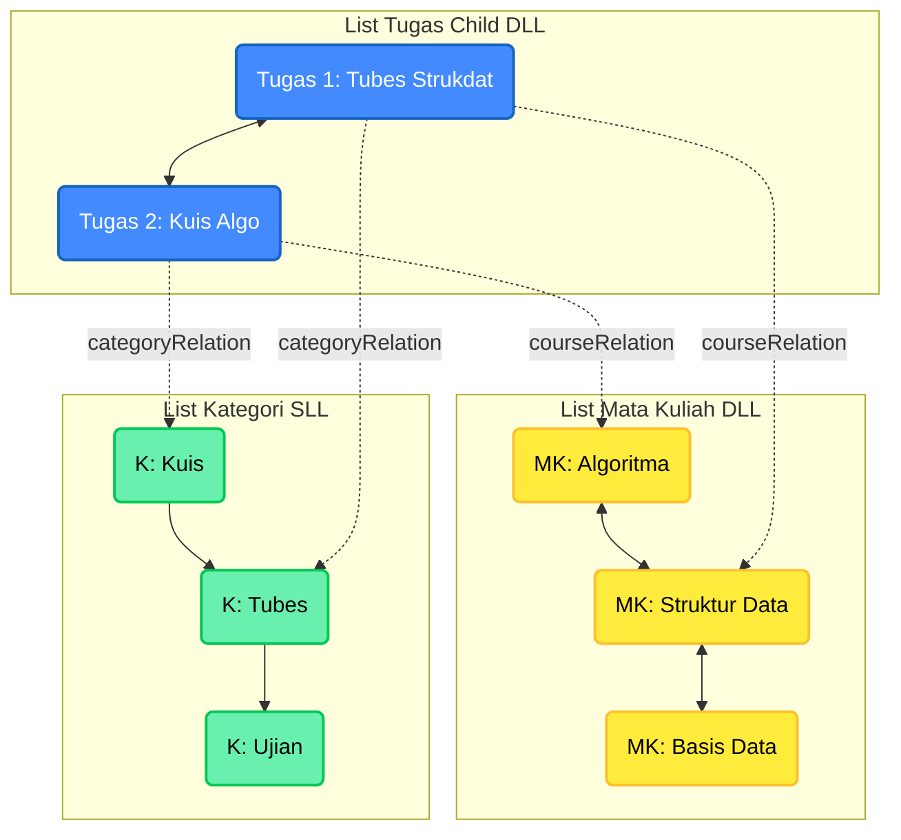

# Student Task Scheduler - Visualisasi MLL

Berikut adalah representasi visual dari struktur Multi-Linked List (MLL) Relasional N-to-M yang digunakan dalam proyek ini.

## Struktur Diagram (Mermaid)

Diagram ini menunjukkan:

1.  **List Mata Kuliah (DLL)**: Parent 1 (Kuning)
2.  **List Kategori (SLL)**: Parent 2 (Hijau)
3.  **List Tugas (DLL)**: Child (Biru) yang menghubungkan keduanya.

